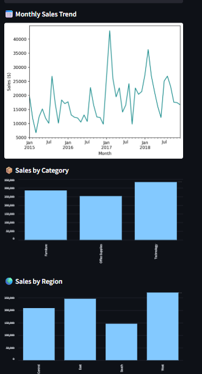

# 📊 Superstore Sales Data Analysis Dashboard

This project is a **Streamlit dashboard** that provides visual insights from a Superstore's sales data including trends, category performance, and region-wise profitability.

---

## 🔍 Features

- 📆 Monthly Sales Trend Line Chart
- 📂 Category-wise Sales Breakdown
- 🌍 Region-wise Sales and Profit
- 📉 Profit vs Sales Scatter Plot
- 📦 Sub-Category Filters (optional extension)

---

## 🚀 Technologies Used

- **Python**
- **Pandas**
- **Streamlit**
- **Matplotlib**

---

## 📁 Files in this Repo

| File               | Description                      |
|--------------------|----------------------------------|
| `app.py`           | Main dashboard code              |
| `train.csv`        | Superstore sales dataset         |
| `requirements.txt` | Required Python libraries        |

---

## ▶️ Run It Locally (Optional)
## 🔗 Live Dashboard

👉 [Click to View Dashboard](https://kxw6qjhtnur5hgjasnigek.streamlit.app/)

## 🖼️ Dashboard Preview

